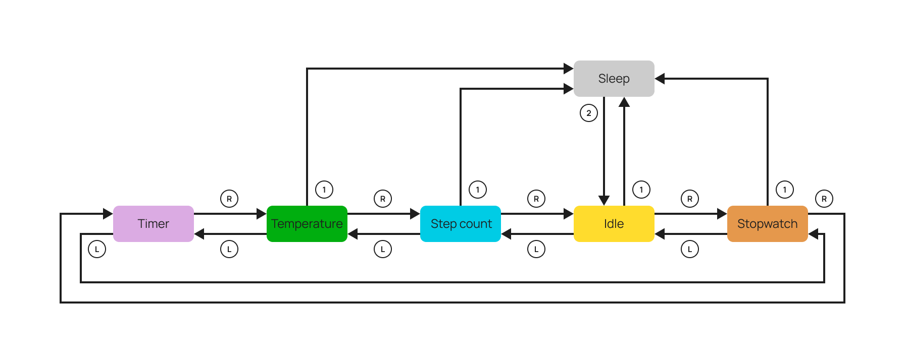
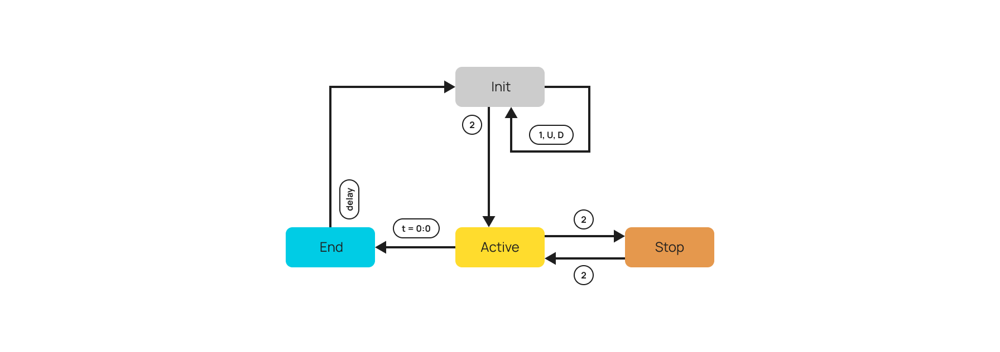

<div align="center">
  
  <h1>Embedded Smartwatch Project</h1>
</div>

This repository contains the project for the "Embedded software for the Internet of Things" course @Unitrento, year 2024/25. Group members: Pedrolli Daniele, Scarano Davide, Valentini Cristian.  
Our team designed and implemented a smartwatch prototype, using the MSP432P401R LaunchPad and EDUMKII BoosterPack. The original idea was to design and implement a step-counter and clock, which then become an (almost) fully-featured smart watch.

## Index

-   [Requirements](#requirements)
-   [Source code structure](#source-code-structure)
-   [Get started](#get-started)
-   [Features and implementation](#features-and-implementation)
-   [Demo video and presentation](#demo-video-and-presentation)
-   [Individual contribution](#individual-contribution)

## Requirements

**Hardware**

-   Texas Instruments MSP432P401R Launchpad
-   BoosterPack EDUMKII
-   (Optional) External battery pack to power the device

**Software**

-   Code Composer Studio IDE
-   MSP432P DriverLib

## Source code structure

_Only the relevant and non automatically-generated directories are in the following diagram_

```
├── README.md
├── Presentation.pdf
├── img                         # Images used for README and presentation
└── src
    └── Controls                # ADC converter, buttons handler, joystick handler
    └── LcdDriver               # Manages the output on LCD display
    └── StepCounter             # Step counter (with dedicated timer)
    └── Stopwatch               # Handles the stopwatch
    └── TemperatureSensor       # Temperature reading + I2C communication
    └── WallClock               # Initialize date (with dedicated timer)
    └── main.c                  # Main source code
```

## Get started

In order to build and modify the project, first clone the `main` branch of the project.

```
git clone https://github.com/pedwoo/Smartwatch-Embedded-Project
```

Then import the `Smartwatch-Embedded-Project` folder in a local Code Composer Studio Workspace. If you wish to run the project on an external battery pack, note that the LaunchPad will need to be connected to the computer at first, in order to flash the board. Disconnecting it then and plugging it into external power will retain the software.

Before building the project we need to manually import the DriverLib (and graphics library) into the project. To achieve this:

-   Go to: **Project $\rightarrow$ Properties $\rightarrow$ Build $\rightarrow$ Arm Compiler $\rightarrow$ Include options** and add the source directory of the DriverLib (by default _C:\ti\simplelink_msp432p4_sdk_3_40_01_02_).
-   Go to: **Project $\rightarrow$ Properties $\rightarrow$ Build $\rightarrow$ Arm Linker $\rightarrow$ File search path** and add
    -   _msp432p4xx_driverlib.lib_ file location (by default _[DriverLib source]/source/ti/devices/msp432p4xx/driverlib/ccs/_)
    -   _grlib.a_ located file location (by defaylt _[DriverLib source]/source/ti/grlib/lib/ccs/m4f/_)

## Features and implementation

### Smartwatch features

-   Wall clock (not synced since no on-board RTC)
-   Timer functionality
-   Stopwatch functionality
-   Step counting
-   Ambient temperature reading

### FSM implementation

The two following graphs present the FSMs used in the device, the symbols used represent:

-   **U, D, L, R**: Up, Down, Left, Right directions of the joystick analog stick
-   **1, 2**: Buttons S1 and S2 respectively



Fig. 1: Device FSM.  
Note that the timer state doesn't have the possibility to go back to sleep, because the button `S1` was required for another functionality.



Fig.2: Timer FSM, separate for improved modularization (and because it was developed separately).

The `END` state is only intended to be used to print on the LCD "time is up", so the system will automatically go back to the init state after a delay. In the Init state, `S1` is used to switch between minutes and seconds when setting the timer amount. `Up` and `Down` are then used to increase or decrease the values.

## Demo video and presentation

## Individual contribution

Considering we had just one board, most of the code was written in person. Nonetheless, each group member focused on a specific section of the project, as follows.

-   Daniele Pedrolli (leader):
    -   Main finite state machine
    -   Merging of all sensors data
    -   Button and joystick readings (+ADC conversion)
-   Scarano Davide:
    -   Temperature sensor reading and I2C communication
    -   Accelerometer sensor data reading and step counting mechanism
-   Valentini Cristian:
    -   Timer finite state machine and implementation
    -   Stopwatch development
